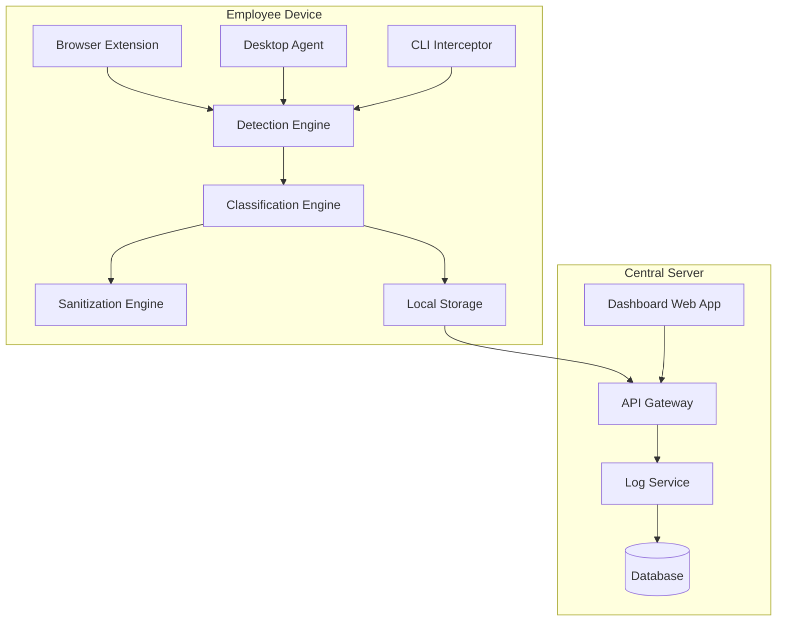

# Design Document: AI Usage Firewall

## Overview

The AI Usage Firewall is a multi-component system that monitors AI tool usage across different platforms (browser, desktop, CLI), classifies prompts for sensitive content using local ML models, and provides a centralized dashboard for compliance monitoring. The architecture prioritizes privacy-by-design with on-device processing and minimal performance overhead.

### Key Design Principles

1. **Privacy-First**: All sensitive data analysis happens locally; no prompt content leaves the device
2. **Lightweight**: Minimal resource footprint to avoid impacting employee productivity
3. **Cross-Platform**: Unified detection across browser extensions, desktop apps, and CLI tools
4. **Real-Time Feedback**: Immediate classification and sanitization before AI tool submission
5. **Audit-Ready**: Comprehensive logging with export capabilities for compliance reporting

## Architecture

### High-Level Architecture



### Component Architecture

The system consists of two main deployment units:

1. **Client-Side Components** (installed on employee devices)
   - Detection agents (browser extension, desktop agent, CLI interceptor)
   - Classification engine with local ML model
   - Sanitization engine
   - Local log buffer

2. **Server-Side Components** (centralized infrastructure)
   - API gateway for log ingestion
   - Log processing and storage service
   - Dashboard web application
   - Database for audit logs

## Components and Interfaces

### 1. Detection Engine

**Purpose**: Identify when employees interact with AI tools and capture prompts before submission.

**Implementation Approaches**:

- **Browser Extension**: Manifest V3 extension that monitors DOM changes and form submissions on known AI tool domains
  - Uses content scripts to inject monitoring code into AI tool pages
  - Intercepts form submissions and API calls to AI services
  - Supported browsers: Chrome, Firefox, Edge

- **Desktop Agent**: Background service that monitors clipboard, window titles, and application network traffic
  - Uses OS-level APIs (Windows: Win32 API, macOS: Accessibility API, Linux: X11/Wayland)
  - Monitors for known AI desktop applications (e.g., ChatGPT desktop app)
  - Requires elevated permissions for system-level monitoring

- **CLI Interceptor**: Shell wrapper that intercepts commands to AI CLI tools
  - Implements shell aliases/functions for common AI CLIs (e.g.,`claude`,`codex`, `gemini` , `gh copilot`, `aichat`)
  - Captures stdin/arguments before passing to actual CLI tool
  - Supports bash, zsh, fish shells

**Interface**:
```typescript
interface DetectionEngine {
  // Register a new AI tool pattern for detection
  registerTool(tool: AIToolPattern): void;
  
  // Start monitoring for AI tool usage
  startMonitoring(): Promise<void>;
  
  // Stop monitoring
  stopMonitoring(): void;
  
  // Event emitted when AI tool usage is detected
  onPromptDetected(callback: (event: PromptEvent) => void): void;
}

interface PromptEvent {
  toolName: string;
  toolType: 'web' | 'desktop' | 'cli';
  prompt: string;
  timestamp: Date;
  userId: string;
  metadata: Record<string, any>;
}
```

### 2. Classification Engine

**Purpose**: Analyze prompts for sensitive content and assign risk levels using on-device ML models.

**Implementation Approach**:

- **ML Model**: Use GLiNER PII Edge v1.0 (knowledgator/gliner-pii-edge-v1.0) for PII detection
  - Lightweight model optimized for PII detection with improved accuracy
  - Zero-shot NER model that can detect multiple PII entity types without fine-tuning
  - Supports detection of: person names, organizations, locations, emails, phone numbers, credit cards, SSN, IP addresses, dates, medical info, and more
  - Fast inference suitable for real-time classification (<500ms for typical prompts)
  - Runs locally via ONNX Runtime (browser/desktop) or PyTorch (desktop/CLI)
  - Model loaded from HuggingFace Hub on first run, then cached locally

- **Pattern Matching**: Regex-based fallback for structured data when model confidence is low
  - Compiled regex patterns for emails, phone numbers, credit cards, IBANs
  - Custom patterns configurable for organization-specific sensitive data
  - Used to augment GLiNER detections and catch edge cases

- **Risk Scoring Algorithm**:
  - Green: No sensitive data detected
  - Amber: 1-3 sensitive entities OR low-confidence detections (score < 0.7)
  - Red: 4+ sensitive entities OR high-confidence PII/financial data (score >= 0.7)

**Interface**:
```typescript
interface ClassificationEngine {
  // Initialize the GLiNER model (downloads and caches if needed)
  initialize(): Promise<void>;
  
  // Classify a prompt and return risk assessment
  classify(prompt: string): Promise<ClassificationResult>;
  
  // Update custom patterns for organization-specific data
  updatePatterns(patterns: SensitivityPattern[]): void;
  
  // Get supported entity types from GLiNER model
  getSupportedEntityTypes(): string[];
}

interface ClassificationResult {
  riskLevel: 'green' | 'amber' | 'red';
  detectedEntities: DetectedEntity[];
  confidence: number;
  processingTimeMs: number;
}

interface DetectedEntity {
  type: 'pii' | 'financial' | 'contract' | 'ip' | 'custom';
  value: string;
  startIndex: number;
  endIndex: number;
  confidence: number;
}
```

### 3. Sanitization Engine

**Purpose**: Generate safe versions of prompts by replacing sensitive data with placeholders.

**Implementation Approach**:

- Uses GLiNER detection results to identify sensitive text spans
- Supports multiple anonymization strategies:
  - Replace: Use typed placeholders (e.g., `[PERSON]`, `[EMAIL]`, `[CREDIT_CARD]`)
  - Mask: Partially mask values (e.g., `***-**-1234` for SSN)
  - Redact: Complete removal of sensitive text
- Default strategy: Replace with typed placeholders for clarity
- Entity types mapped to human-readable placeholder names
- Maintains prompt structure and readability
- Provides diff view showing original vs sanitized

**Interface**:
```typescript
interface SanitizationEngine {
  // Generate sanitized version of prompt
  sanitize(prompt: string, entities: DetectedEntity[]): SanitizationResult;
  
  // Generate a diff between original and sanitized
  generateDiff(original: string, sanitized: string): DiffResult;
}

interface SanitizationResult {
  sanitizedPrompt: string;
  replacements: Replacement[];
  isFullySanitized: boolean;
}

interface Replacement {
  original: string;
  placeholder: string;
  type: string;
}
```

### 4. Dashboard Web Application

**Purpose**: Provide centralized visibility into AI tool usage with filtering, search, and export capabilities.

**Implementation Approach**:

- **Frontend**: React-based SPA with TypeScript
  - Component library: shadcn/ui or Material-UI for rapid development
  - State management: React Query for server state, Zustand for client state
  - Charts: Recharts or Chart.js for usage visualizations

- **Key Views**:
  - Overview dashboard with summary metrics and risk distribution
  - Detailed log table with filtering and search
  - User activity view showing per-user statistics
  - Tool usage breakdown by AI service
  - Export interface for audit reports

**Interface**:
```typescript
interface DashboardAPI {
  // Fetch logs with filtering and pagination
  getLogs(filter: LogFilter, pagination: Pagination): Promise<LogPage>;
  
  // Get summary statistics
  getSummaryStats(timeRange: TimeRange): Promise<SummaryStats>;
  
  // Export logs for audit
  exportLogs(filter: LogFilter, format: 'csv' | 'json'): Promise<Blob>;
  
  // Get configuration
  getConfig(): Promise<FirewallConfig>;
  
  // Update configuration
  updateConfig(config: Partial<FirewallConfig>): Promise<void>;
}
```

### 5. API Gateway & Log Service

**Purpose**: Receive logs from client devices and provide data to dashboard.

**Implementation Approach**:

- **Technology**: Python FastAPI for high-performance async API
  - Async/await support for concurrent request handling
  - Automatic OpenAPI documentation generation
  - Built-in request validation with Pydantic models
  - Native integration with Presidio (both Python-based)
- **Authentication**: JWT-based auth for device registration and API access
- **Rate Limiting**: Per-device rate limits using slowapi middleware
- **Batch Processing**: Accept batched log uploads from clients to reduce network overhead

**Interface**:
```typescript
interface LogServiceAPI {
  // Upload logs from client device (batched)
  POST /api/v1/logs/batch
  Body: {
    deviceId: string;
    logs: LogEntry[];
  }
  
  // Query logs (for dashboard)
  GET /api/v1/logs
  Query: {
    startDate?: string;
    endDate?: string;
    riskLevel?: string;
    toolName?: string;
    userId?: string;
    page?: number;
    limit?: number;
  }
  
  // Get summary statistics
  GET /api/v1/stats/summary
  Query: {
    startDate?: string;
    endDate?: string;
  }
}
```

## Data Models

### LogEntry

```typescript
interface LogEntry {
  id: string;                    // UUID
  timestamp: Date;               // When the interaction occurred
  deviceId: string;              // Identifier for the employee's device
  userId: string;                // Employee identifier
  toolName: string;              // AI tool name (e.g., "ChatGPT", "Claude")
  toolType: 'web' | 'desktop' | 'cli';
  riskLevel: 'green' | 'amber' | 'red';
  promptLength: number;          // Character count (not storing actual prompt)
  detectedEntityTypes: string[]; // Types of sensitive data found
  entityCount: number;           // Number of sensitive entities
  wasSanitized: boolean;         // Whether user used sanitized version
  metadata: {
    browserVersion?: string;
    osVersion?: string;
    agentVersion: string;
  };
}
```

### FirewallConfig

```typescript
interface FirewallConfig {
  id: string;
  organizationId: string;
  monitoredTools: {
    toolName: string;
    enabled: boolean;
    toolType: 'web' | 'desktop' | 'cli';
  }[];
  sensitivityThresholds: {
    amberMinEntities: number;     // Min entities for amber (default: 1)
    redMinEntities: number;       // Min entities for red (default: 4)
    highConfidenceThreshold: number; // Confidence for auto-red (default: 0.9)
  };
  customPatterns: SensitivityPattern[];
  logRetentionDays: number;       // Between 30-365
  updatedAt: Date;
  updatedBy: string;
}

interface SensitivityPattern {
  id: string;
  name: string;
  pattern: string;                // Regex pattern
  type: 'pii' | 'financial' | 'contract' | 'ip' | 'custom';
  enabled: boolean;
}
```

## Error Handling

### Client-Side Error Handling

1. **Detection Failures**:
   - If detection engine fails, log error locally and continue monitoring
   - Fallback: Allow AI tool usage but log failure event
   - User notification: Silent failure with background retry

2. **Classification Failures**:
   - If GLiNER model fails to load, fall back to regex-only classification
   - If classification times out (>500ms), mark as amber (cautious default)
   - User notification: Warning banner about reduced accuracy
   - GLiNER model is cached locally after first download for fast subsequent loads

3. **Network Failures**:
   - Buffer logs locally if server is unreachable
   - Retry with exponential backoff (max 5 attempts)
   - Local storage limit: 1000 log entries, then rotate oldest

### Server-Side Error Handling

1. **Database Failures**:
   - Return 503 Service Unavailable with retry-after header
   - Queue writes to message broker (e.g., Redis) for retry
   - Alert administrators for persistent failures

2. **Invalid Data**:
   - Validate all incoming logs against schema
   - Return 400 Bad Request with detailed error messages
   - Log validation failures for debugging

3. **Rate Limiting**:
   - Return 429 Too Many Requests with retry-after header
   - Implement per-device quotas (e.g., 1000 logs/hour)

## Testing Strategy

### Unit Testing

- **Classification Engine**: Test with known PII samples, edge cases, and false positives
- **Sanitization Engine**: Verify correct placeholder replacement and diff generation
- **API Endpoints**: Test all CRUD operations, validation, and error responses

### Integration Testing

- **End-to-End Flow**: Simulate prompt detection → classification → sanitization → logging → dashboard display
- **Cross-Platform**: Test browser extension, desktop agent, and CLI interceptor independently
- **Database Operations**: Test log ingestion, querying, and retention policies

### Performance Testing

- **Classification Latency**: Benchmark with prompts of varying lengths (100-10,000 chars)
- **Dashboard Load Time**: Test with datasets of 10K, 100K, and 1M log entries
- **Concurrent Users**: Load test API with 100+ simultaneous dashboard users

### Security Testing

- **Data Privacy**: Verify no prompt content is transmitted to server
- **Authentication**: Test JWT validation and token expiration
- **Input Validation**: Fuzz test API endpoints for injection vulnerabilities
- **XSS Prevention**: Test dashboard with malicious log data

### User Acceptance Testing

- **Employee Experience**: Verify <100ms detection latency and clear sanitization UI
- **Admin Experience**: Test configuration changes and dashboard usability
- **Compliance Officer**: Validate export formats and audit trail completeness

## Deployment Architecture

### Client Deployment

- **Browser Extension**: Distributed via Chrome Web Store, Firefox Add-ons, Edge Add-ons
- **Desktop Agent**: Packaged as installer (MSI for Windows, DMG for macOS, DEB/RPM for Linux)
- **CLI Interceptor**: Shell script installer that modifies shell config files

### Server Deployment

- **Infrastructure**: Docker containers orchestrated with Kubernetes or Docker Compose
- **Components**:
  - FastAPI Backend: 2+ replicas behind load balancer (using Uvicorn/Gunicorn)
  - GLiNER Classification Service: Shared model instances for prompt analysis (optional server-side classification)
  - Database: PostgreSQL with read replicas
  - Dashboard: Static files served via CDN

### Configuration Management

- Environment-based configuration (dev, staging, production)
- Secrets management via environment variables or secret manager
- Feature flags for gradual rollout of new capabilities

## Security Considerations

1. **Data Minimization**: Store only metadata, not actual prompt content
2. **Encryption**: TLS 1.3 for all client-server communication
3. **Access Control**: Role-based access (admin, compliance officer, viewer)
4. **Audit Logging**: Log all configuration changes and data exports
5. **Device Authentication**: Unique device certificates for client authentication
